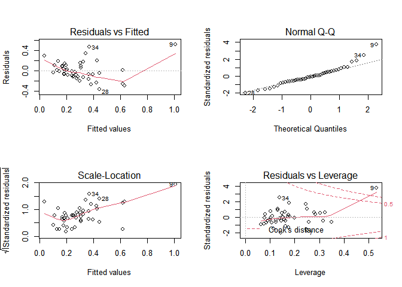
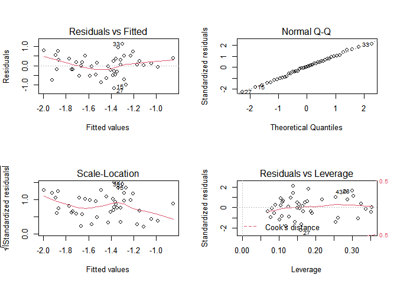
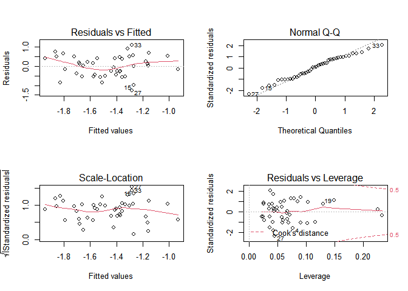
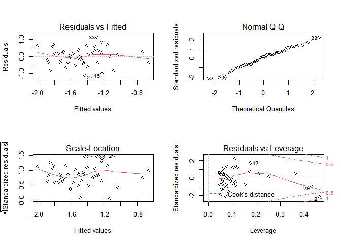
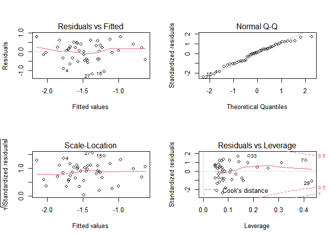

Model Diagnostics
================
Wenzhao Wu
12/13/2020

``` r
hc_df = read.csv("./data/HateCrimes.csv") %>%
  rename("income" = "median_household_income",
         "degree" = "perc_population_with_high_school_degree",
         "noncitizen" = "perc_non_citizen",
         "nonwhite" = "perc_non_white",
         "hc_rate" = "hate_crimes_per_100k_splc") %>%
  mutate(income = as.numeric(income),
         degree = as.numeric(degree),
         noncitizen = as.numeric(noncitizen),
         nonwhite = as.numeric(nonwhite),
         hc_rate = as.numeric(hc_rate),
         gini_index = as.numeric(gini_index),
         unemployment = as.factor(unemployment),
         urbanization = as.factor(urbanization)) %>%
  dplyr::select(-state) %>%
  drop_na()
```

    ## Warning: Problem with `mutate()` input `hc_rate`.
    ## i NAs introduced by coercion
    ## i Input `hc_rate` is `as.numeric(hc_rate)`.

    ## Warning in mask$eval_all_mutate(dots[[i]]): NAs introduced by coercion

# Fit full model & Model diagnostics

The 9th observation is an influential point.

``` r
fit_full = lm(hc_rate~.,data = hc_df)
par(mfrow=c(2,2))
plot(fit_full)
```

<!-- -->

``` r
try = hc_df[-9,] 
fit_try = lm(hc_rate~., data = try)
summary(fit_try)
```

    ## 
    ## Call:
    ## lm(formula = hc_rate ~ ., data = try)
    ## 
    ## Residuals:
    ##      Min       1Q   Median       3Q      Max 
    ## -0.27113 -0.08632 -0.03593  0.09348  0.45347 
    ## 
    ## Coefficients:
    ##                   Estimate Std. Error t value Pr(>|t|)  
    ## (Intercept)     -3.086e+00  1.895e+00  -1.628   0.1121  
    ## unemploymentlow  1.782e-02  5.748e-02   0.310   0.7583  
    ## urbanizationlow -5.035e-02  7.023e-02  -0.717   0.4780  
    ## income          -2.976e-06  4.787e-06  -0.622   0.5381  
    ## degree           2.898e+00  1.564e+00   1.853   0.0721 .
    ## noncitizen       1.568e+00  1.506e+00   1.041   0.3047  
    ## gini_index       2.302e+00  2.085e+00   1.104   0.2769  
    ## nonwhite        -3.276e-01  3.023e-01  -1.083   0.2858  
    ## ---
    ## Signif. codes:  0 '***' 0.001 '**' 0.01 '*' 0.05 '.' 0.1 ' ' 1
    ## 
    ## Residual standard error: 0.1614 on 36 degrees of freedom
    ## Multiple R-squared:  0.2576, Adjusted R-squared:  0.1132 
    ## F-statistic: 1.784 on 7 and 36 DF,  p-value: 0.1208

``` r
summary(fit_full) #exclusion/inclusion causes major changes in estimates
```

    ## 
    ## Call:
    ## lm(formula = hc_rate ~ ., data = hc_df)
    ## 
    ## Residuals:
    ##      Min       1Q   Median       3Q      Max 
    ## -0.36552 -0.10314 -0.01316  0.09731  0.51389 
    ## 
    ## Coefficients:
    ##                   Estimate Std. Error t value Pr(>|t|)    
    ## (Intercept)     -8.296e+00  1.908e+00  -4.349 0.000103 ***
    ## unemploymentlow  1.307e-02  7.173e-02   0.182 0.856425    
    ## urbanizationlow  3.309e-02  8.475e-02   0.390 0.698475    
    ## income          -1.504e-06  5.961e-06  -0.252 0.802193    
    ## degree           5.382e+00  1.835e+00   2.933 0.005735 ** 
    ## noncitizen       1.233e+00  1.877e+00   0.657 0.515332    
    ## gini_index       8.624e+00  1.973e+00   4.370 9.67e-05 ***
    ## nonwhite        -5.842e-03  3.673e-01  -0.016 0.987396    
    ## ---
    ## Signif. codes:  0 '***' 0.001 '**' 0.01 '*' 0.05 '.' 0.1 ' ' 1
    ## 
    ## Residual standard error: 0.2014 on 37 degrees of freedom
    ## Multiple R-squared:  0.461,  Adjusted R-squared:  0.3591 
    ## F-statistic: 4.521 on 7 and 37 DF,  p-value: 0.001007

\#Log transformation and remove influential point

``` r
log_df = hc_df[-9,] %>%
  mutate(log_rate = log(hc_rate)) %>%
  dplyr::select(-hc_rate)
```

# Fit the transformed full model

``` r
fit_log = lm(log_rate~., data = log_df)
par(mfrow=c(2,2))
plot(fit_log)
```

<!-- -->

``` r
#check collinearity
vif(fit_log)
```

    ## unemploymentlow urbanizationlow          income          degree      noncitizen 
    ##        1.395922        2.079461        2.970238        4.407167        3.470719 
    ##      gini_index        nonwhite 
    ##        2.214828        3.064669

# Fit the stepwise model

``` r
step(fit_log)
```

    ## Start:  AIC=-41.5
    ## log_rate ~ unemployment + urbanization + income + degree + noncitizen + 
    ##     gini_index + nonwhite
    ## 
    ##                Df Sum of Sq    RSS     AIC
    ## - noncitizen    1   0.02825 11.938 -43.397
    ## - income        1   0.04789 11.957 -43.325
    ## - nonwhite      1   0.07348 11.983 -43.231
    ## - urbanization  1   0.20824 12.118 -42.739
    ## - unemployment  1   0.39377 12.303 -42.070
    ## - gini_index    1   0.50111 12.411 -41.688
    ## <none>                      11.909 -41.502
    ## - degree        1   0.72239 12.632 -40.911
    ## 
    ## Step:  AIC=-43.4
    ## log_rate ~ unemployment + urbanization + income + degree + gini_index + 
    ##     nonwhite
    ## 
    ##                Df Sum of Sq    RSS     AIC
    ## - income        1   0.03060 11.968 -45.285
    ## - nonwhite      1   0.04589 11.984 -45.229
    ## - urbanization  1   0.33294 12.271 -44.187
    ## - unemployment  1   0.42320 12.361 -43.865
    ## - gini_index    1   0.52483 12.463 -43.504
    ## <none>                      11.938 -43.397
    ## - degree        1   0.69834 12.636 -42.896
    ## 
    ## Step:  AIC=-45.28
    ## log_rate ~ unemployment + urbanization + degree + gini_index + 
    ##     nonwhite
    ## 
    ##                Df Sum of Sq    RSS     AIC
    ## - nonwhite      1   0.09049 12.059 -46.953
    ## - urbanization  1   0.30273 12.271 -46.186
    ## - unemployment  1   0.39903 12.367 -45.842
    ## - gini_index    1   0.51288 12.481 -45.439
    ## <none>                      11.968 -45.285
    ## - degree        1   0.94584 12.914 -43.938
    ## 
    ## Step:  AIC=-46.95
    ## log_rate ~ unemployment + urbanization + degree + gini_index
    ## 
    ##                Df Sum of Sq    RSS     AIC
    ## - urbanization  1   0.21612 12.275 -48.172
    ## - unemployment  1   0.47128 12.530 -47.267
    ## - gini_index    1   0.53064 12.589 -47.059
    ## <none>                      12.059 -46.953
    ## - degree        1   1.38655 13.445 -44.164
    ## 
    ## Step:  AIC=-48.17
    ## log_rate ~ unemployment + degree + gini_index
    ## 
    ##                Df Sum of Sq    RSS     AIC
    ## - unemployment  1    0.4003 12.675 -48.760
    ## <none>                      12.275 -48.172
    ## - gini_index    1    1.0293 13.304 -46.629
    ## - degree        1    1.6881 13.963 -44.502
    ## 
    ## Step:  AIC=-48.76
    ## log_rate ~ degree + gini_index
    ## 
    ##              Df Sum of Sq    RSS     AIC
    ## <none>                    12.675 -48.760
    ## - gini_index  1   0.87421 13.549 -47.825
    ## - degree      1   2.39135 15.067 -43.155

    ## 
    ## Call:
    ## lm(formula = log_rate ~ degree + gini_index, data = log_df)
    ## 
    ## Coefficients:
    ## (Intercept)       degree   gini_index  
    ##     -14.611        9.509       10.811

``` r
fit_step = lm(log_rate~degree + gini_index, data = log_df)
par(mfrow=c(2,2))
plot(fit_step)
```

<!-- -->

``` r
#check the collinearity
vif(fit_step)
```

    ##     degree gini_index 
    ##   1.773775   1.773775

# Fit the interaction model

``` r
fit_inter1 = lm(log_rate ~ degree + gini_index*unemployment, data = log_df)
par(mfrow=c(2,2))
plot(fit_inter1)
```

<!-- -->

``` r
#the 2th observation is identified as an influential point, so consider removing it and re-fit the interaction model

no2_df = log_df[-2,]
fit_inter2 = lm(log_rate ~ degree + gini_index*unemployment, data = no2_df)
par(mfrow=c(2,2))
plot(fit_inter2)
```

<!-- -->
