## Methods

### Data Description

**Outcome of interest:**

o Hate_crimes_per_100k_splc: hate crime rate per 100,000 population; data was recorded during the first weeks of November, 2016 by the Southern Poverty Law Centr(SPLC). The SPLC uses media accounts and self-report entries including both hate crimes and non-prosecutable hate incidents.

**Covariates:**

o Unemployment (2016): level of state unemployment - high/low

o Urbanization (2015): level of state urbanization – high/low (based on the percentage of population living in metro areas)

o Median_household_income (2016): median household income per state 

o Perc_population_with_high_school_degree (2009): percentage of adults (>25 yrs.) with a high school degree

o Perc_non_citizen (2015): percentage of population that are not US citizens

o Perc_non_white (2015): percentage of population that are non-white

o Gini_index (2015): index measuring income inequality (range 0-100)

### Data Exploration

For conciseness, the variables "median_household_income", "perc_population_with_high_degree", "perc_non_citizen" and "perc_non_white" are shorten as "income", "degree", "noncitizen", and "nonwhite", respectively. The data on hate crime rates and covariates are not complete in Hawaii, Miane, Mississippi, North Dakota, South Dakota and Wyoming, thus those states are excluded from analysis. The 9th observation is identified as an influential point among the remaining observations, which is excluded as well. 

### Statistical Analysis

**Outcome Transformation:**
The logarithm transformation of the outcome values is recognized by using `boxcox()` function on the full regression model, given $\lambda=0$.

**Regression:** 
Linear regression models are applied to examine associations between the hate crime rates and different variables of interest. A correlation matrix is build to visualize potential multicollinearity between variables, and `vif()` is used to further verify collinearity (i.e., VIF > 5 implies collinearity). We select two models based on the stepwise results. The two-predictor model (degree and gini_index) is obtained from `step(direction="backward")`; while the 7-predictor model is obtained from `step(directionn="forward")`. The third model contains predictors degree and gini_index, plus an interaction term of gini_index and unemployment. ANOVA test is applied to analyze nested models and check if the larger model is superior. The adjusted $R^2$, AIC and Mallow's Cp are three critera that the analysis is based on to examine all selected models and recommend the "best" one (i.e., with the smallest AIC, the largest $R^2$, and Cp smaller than the number of parameters). We have checked model assumptions for all the analyses. Finally, cross-validation and bootstrap measure how well models fit and their predictive abilities. All of the procedures of data exploration and analysis are conducted using Rstudio. A significance level of 0.05 is pre-specified, except for notation.

## Results

### Model Selection

As [Figure.1](all_graphs/outcome_distribution.jpg) shows, the distribution of the outcome is right-skewed, so it might be necessary to transform the outcome values. Given $\lambda=0$ suggested by the box-cox result ([Figure.2](all_graphs/box_cox.png)), logarithm transformation needs to be done on the hate crime rates. After comparing the QQ plots before ([Figure.3](all_graphs/qq_before.png)) and after ([Figure.4](all_graphs/qq_after.png))transformation, it is observed that the residuals are distributed more normally in the latter graph. The correlation between variables is displayed by the two plots ([Figure.5](all_graphs/cor_matrix1.png), [Figure.6](all_graphs/cor_matrix2.png)), from which we can see that there exist highly positive correlations between "income" and "degree", and between "noncitizen" and "nonwhite". In addition, the correlations between "urbanization:low" and "noncitizen", and between "degree" and "gini_index" are both highly negative. However, when applying the variance inflation factor (VIF) to the full model, none of the predictors are highly correlated with each other.  

The stepwise procedure with "backward" and "forward" provides two models, respectively. The first model follows: $\hat{Y} = \beta_0 + \beta_1(\hat{degree})+\beta_2(\hat{Y})$. The second model contains all variables of interest: $\hat{Y} = \beta_0 \beta_1(\hat{degree})+\beta_2(\hat{gini\ index}) +\beta_3(\hat{unemployment}) +\beta_4(\hat{urbanization}) +\beta_5(\hat{income}) +\beta_6(\hat{noncitizen}) +\beta_7(\hat{nonwhite})$. The third model is included to explore the interaction effect of "urbanization" and "gini index" on the outcome, thus the equation follows: $\hat{Y} = \beta_0 + \beta_1(\hat{degree})+\beta_2(\hat{gini\ index}) +\beta_3(\hat{unemployment}) +\beta_4(\hat{gini\ index*unemployment})$. 

As [Figure.7](all_graphs/interaction.png) shows, two crossed lines indicate the interaction term might be considered in the model. To further verify it, we use ANOVA for nested models (p-value=0.1296) and look for any changes in the adjusted $R^2$. We find that the adjusted $R^2$ increases from 0.1185 to 0.1654 which exceeds 6% increase.Thus, we include the interaction term in the third model for final comparison. 

According to the critera comparison of three models, the Cp values are all less or equal to the number of parameters. The 2-predictor model has an AIC of 78.11, and an adjusted $R^2$ of 0.118. The model with the interaction term has the smallest AIC of 77.50, and the largest $R^2$ of 0.165. In contrary, the full model has the largest AIC and the smallest $R^2$.

Since the interaction term is present, we further analyze the model by stratification by levels of unemployment (high/low), and check if the coefficient of gini index changes in direction and/or magnitude. As a result, the strata-specific coeffieicient has an opposite direction (high unemployment: $\beta=-1.18, p>0.05$; low unemployment: $\beta=19.37, p<0.05$). The association between the income inequality (gini index) and hate crime rates varies by different levels of unemployment. Other covariates are all considered insignificant and cannot improve the model fitting if adding them in. 

### Model Diagnostics

The assessment of model assumptions are done with diagnostic plots on all models. The 9th observation from District of Columbia can be identified as an influential point in the graph of "Residuals vs Leverage" ([Figure.8](all_graphs/raw.png)), as the Cook's distance is even larger than 1. Also, the exclusion/inclusion of the 9th point causes major changes in regression functions, including variation in estimates, p-values, $R^2$ and etc. The diagnostic plots of the outcome before transformation detect unequal error variance (i.e., heteroscedasticity), and non-normality of residuals. With all being mentioned, the transformation of the hate crime rate is necessary and justifiable. 

After removing the 9th observation and take logarithm of the outcome, the residuals are distributed much more normal ([Figure.9](all_graphs/log_full.png) than before, and they are not clusted together. Instead, the residuals form an almost horizontal band bouncing around 0 and are more dispersal along the range of predictors. The assumptions of the 2-predictor model are met as well ([Figure.10](all_graphs/step.png)), although the normality of residuals fluctuates a bit compared to the 7-predictor one. Our third model is demonstrated having a constant error variance (i.e., homoscedasticity). Interestingly, the 2nd observation in this model is detected as an influential point with a Cook's distance of more than 0.5 ([Figure.11](all_graphs/inter_full.png)). After excluding it, all assumptions are met again ([Figure.12](all_graphs/inter_no2th.png)).

### Model Validation

## Appendix Page

Figure.1
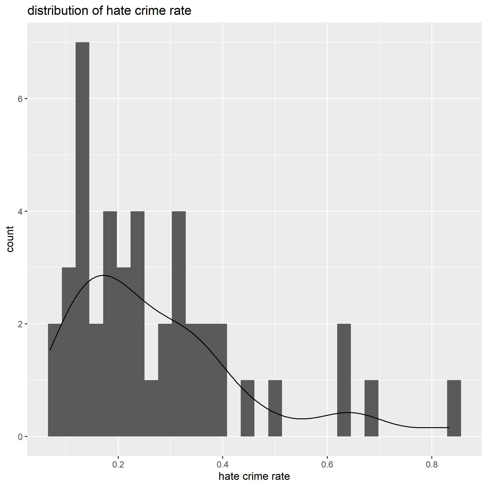

Figure.2
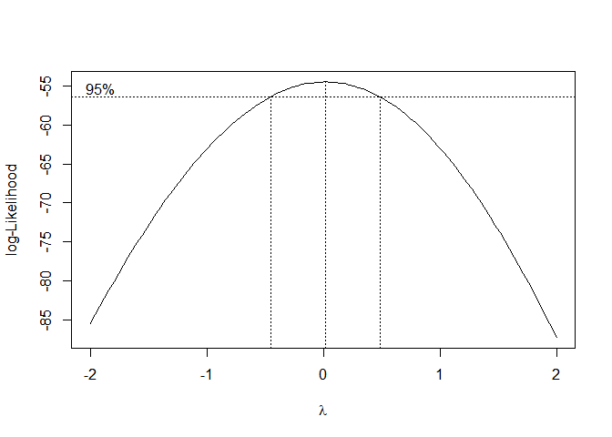

Figure.3
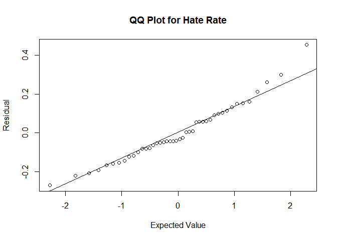

Figure.4
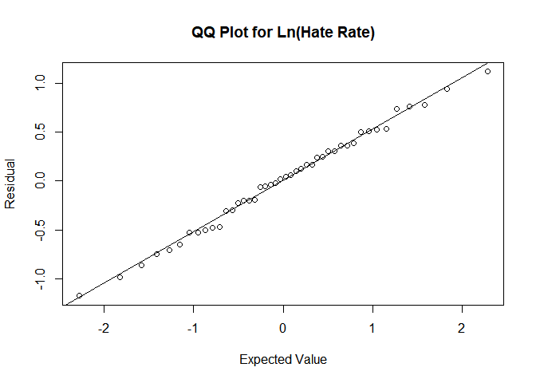

Figure.5
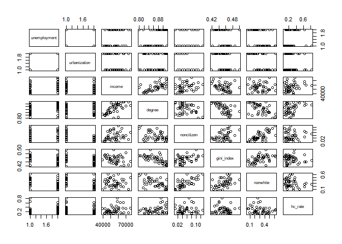

Figure.6
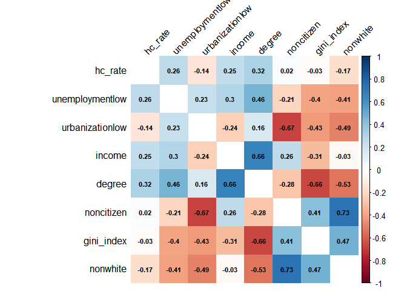

Figure.7
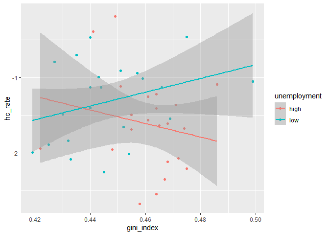

Figure.8
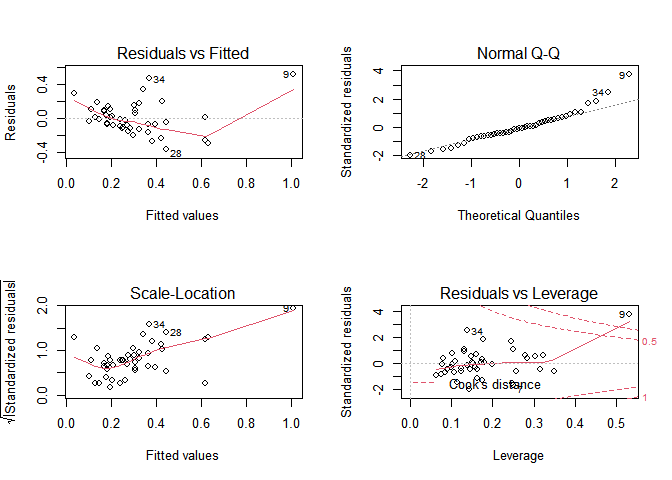

Figure.9
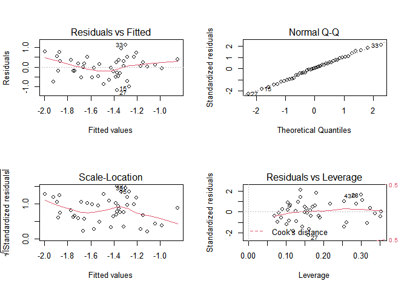

Figure.10
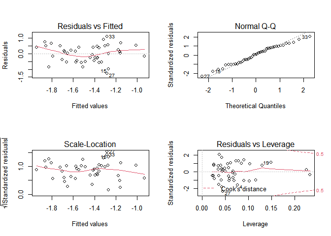

Figure.11
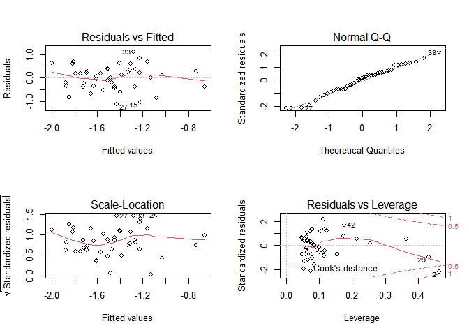

Figure.12
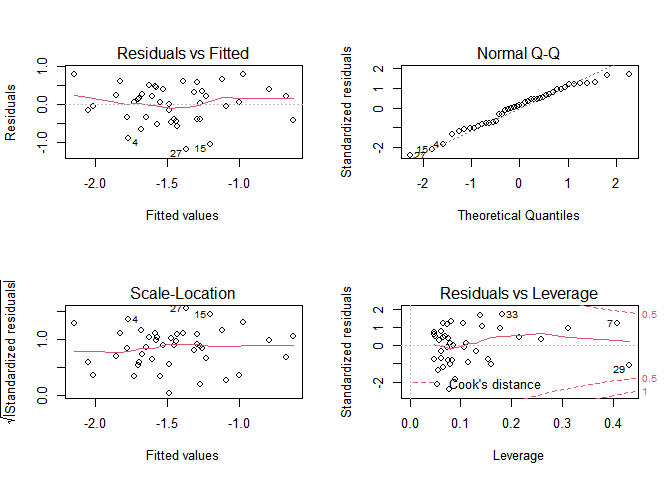

Table.1 Comparison of 3 models

$\begin{tabular}{c|c|c|c} Statistics&Model1(p=3) &Model2(p=5) &Model3(p=8) \\Coeff.(SE Coeff) & & & \\b0 &-14.611(5.359) &-8.662(6.138) &-1.234e01(6.754) \\b1 &9.509(3.419) &8.427(3.474) &8.238(5.575) \\b2 &10.811(6.429) &0.279(9.483) &9.146(7.431) \\b3 & &8.235(4.933)  &2.235e-01(2.049e-01) \\b4 & &18.526(10.804)  &-1.986e-01(2.503e-01) \\b5 & & &-6.492e-06(1.706e-05) \\b6 & & &1.568(5.367) \\b7 & & &-5.079e-01(1.078)\\ & & & \\AIC &78.107 &77.497 &85.365 \\Cp &0.315 &0.504 &8.000 \\Adj R-sq &0.118 &0.165 &0.057 \end{tabular}$

