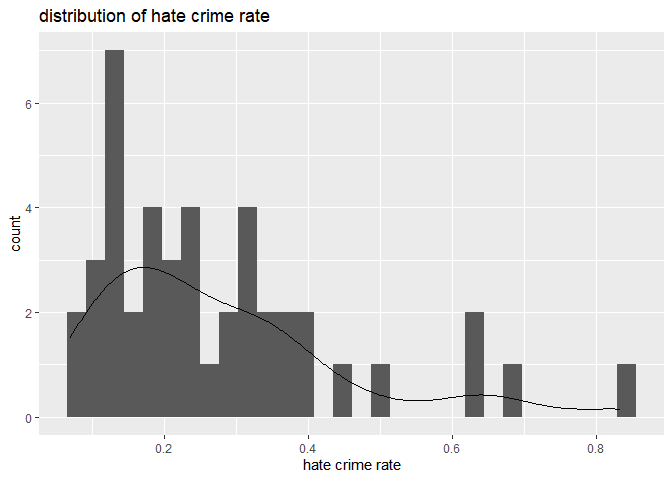
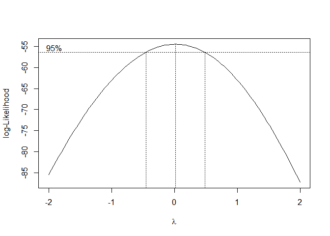
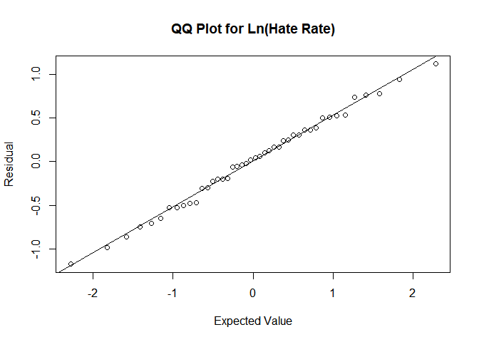
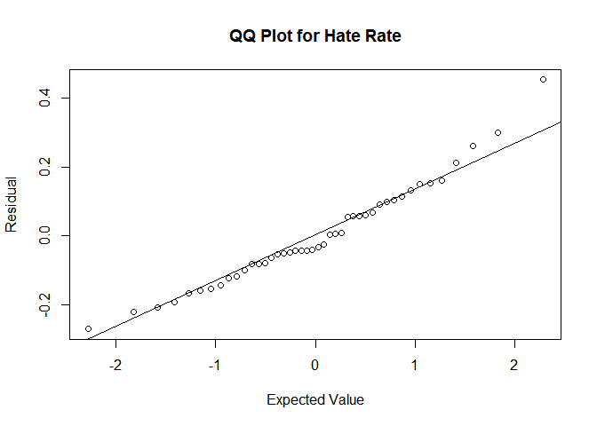
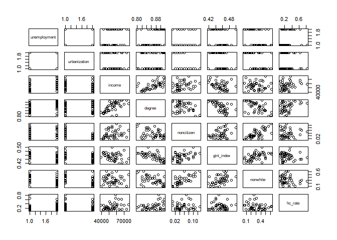
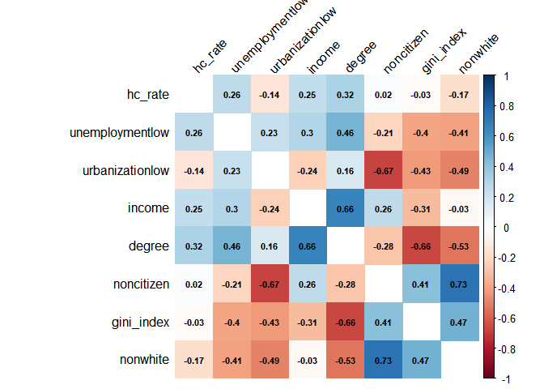
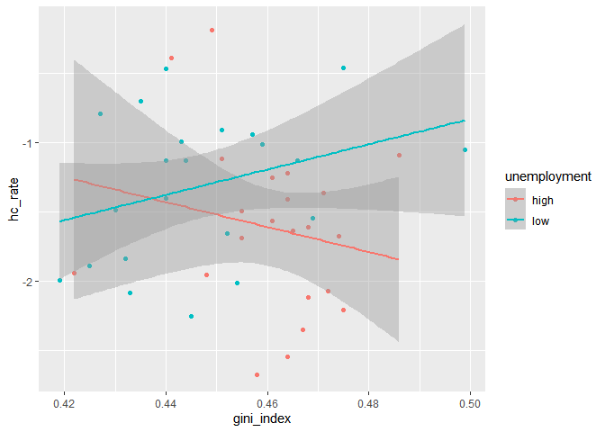
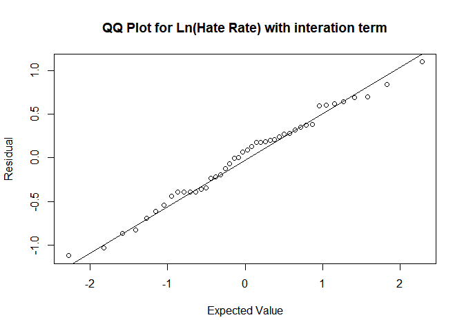

Model Selection
================
Chen Mo
12/14/2020

## Data Cleaning

``` r
#drop missing values from data set#
crime_df = read.csv("./data/HateCrimes.csv") %>%
 rename("income" = "median_household_income",
         "degree" = "perc_population_with_high_school_degree",
         "noncitizen" = "perc_non_citizen",
         "nonwhite" = "perc_non_white",
         "hc_rate" = "hate_crimes_per_100k_splc") %>%
  mutate(income = as.numeric(income),
         degree = as.numeric(degree),
         noncitizen = as.numeric(noncitizen),
         nonwhite = as.numeric(nonwhite),
         hc_rate = as.numeric(hc_rate),
         gini_index = as.numeric(gini_index),
         unemployment = as.factor(unemployment),
         urbanization = as.factor(urbanization)) %>%
  drop_na() %>%
  dplyr::select(-state)
```

    ## Warning: Problem with `mutate()` input `hc_rate`.
    ## i NAs introduced by coercion
    ## i Input `hc_rate` is `as.numeric(hc_rate)`.

    ## Warning in mask$eval_all_mutate(dots[[i]]): NAs introduced by coercion

## Outlier

``` r
#drop outlier#  
crime_df = crime_df[-9,] 
```

## Descriptive Analysis

``` r
plot = ggplot(aes(x = hc_rate), data = crime_df) + geom_histogram() + geom_density() + labs(x = "hate crime rate", title = "distribution of hate crime rate")
plot
```

    ## `stat_bin()` using `bins = 30`. Pick better value with `binwidth`.

<!-- -->

``` r
#Since the distribution of hate crime rate is right-skewed, we think there might need potential transformation
```

## Model Transformation

``` r
fit_full_original = lm(data = crime_df, hc_rate ~ .)

#box-cox for full model without transformation
fit_full_original %>% 
  MASS::boxcox()
```

<!-- -->

``` r
#From box-cox plot, we think there needs log transformation.

#Take transformation#  
crime_log = 
  crime_df %>%
  mutate(hc_rate = log(hc_rate))

fit_full_log = lm(data = crime_log, hc_rate ~ .)
#QQ plot for model with transformation and without transformation
qqnorm(resid(fit_full_log), xlab = "Expected Value", ylab = "Residual", main = "")
qqline(resid(fit_full_log))
title("QQ Plot for Ln(Hate Rate)")
```

<!-- -->

``` r
qqnorm(resid(fit_full_original), xlab = "Expected Value", ylab = "Residual", main = "")
qqline(resid(fit_full_original))
title("QQ Plot for Hate Rate")
```

<!-- -->

``` r
#From two QQ-plots, we think log transformation is better
```

\#FiveThirtyEight\#

``` r
fit_fivethirtyeight = lm(data = crime_df, hc_rate ~ gini_index + degree)
summary(fit_fivethirtyeight)
```

    ## 
    ## Call:
    ## lm(formula = hc_rate ~ gini_index + degree, data = crime_df)
    ## 
    ## Residuals:
    ##      Min       1Q   Median       3Q      Max 
    ## -0.25186 -0.10799 -0.02101  0.09700  0.49954 
    ## 
    ## Coefficients:
    ##             Estimate Std. Error t value Pr(>|t|)   
    ## (Intercept)  -3.8396     1.5151  -2.534  0.01519 * 
    ## gini_index    3.2449     1.8174   1.785  0.08159 . 
    ## degree        3.0482     0.9666   3.154  0.00302 **
    ## ---
    ## Signif. codes:  0 '***' 0.001 '**' 0.01 '*' 0.05 '.' 0.1 ' ' 1
    ## 
    ## Residual standard error: 0.1572 on 41 degrees of freedom
    ## Multiple R-squared:  0.1977, Adjusted R-squared:  0.1585 
    ## F-statistic: 5.051 on 2 and 41 DF,  p-value: 0.01094

``` r
#Further analysis will be explained after we select our final model
```

\#Model Selection\#

``` r
#Test for collinearity
pairs(crime_df)
```

<!-- -->

``` r
corr_data = 
  cor(cbind(hc_rate = pull(crime_log, hc_rate),
        model.matrix(hc_rate~., data = crime_df)[,-1])
  )

corr_data %>% 
  corrplot(method = "color", addCoef.col = "black", tl.col = "black", tl.srt = 45, insig = "blank" , number.cex = 0.7, diag = FALSE)
```

<!-- -->

``` r
#We can find some of the predictors might have collinearity issues. We use VIF method to verify.

vif(fit_full_log) #None of VIF exceeds 5, meaning none of the predictors are highly correlated with each other.
```

    ## unemploymentlow urbanizationlow          income          degree      noncitizen 
    ##        1.395922        2.079461        2.970238        4.407167        3.470719 
    ##      gini_index        nonwhite 
    ##        2.214828        3.064669

``` r
#Stepwise Selection
#Backward
step(fit_full_log, direction = 'backward')
```

    ## Start:  AIC=-41.5
    ## hc_rate ~ unemployment + urbanization + income + degree + noncitizen + 
    ##     gini_index + nonwhite
    ## 
    ##                Df Sum of Sq    RSS     AIC
    ## - noncitizen    1   0.02825 11.938 -43.397
    ## - income        1   0.04789 11.957 -43.325
    ## - nonwhite      1   0.07348 11.983 -43.231
    ## - urbanization  1   0.20824 12.118 -42.739
    ## - unemployment  1   0.39377 12.303 -42.070
    ## - gini_index    1   0.50111 12.411 -41.688
    ## <none>                      11.909 -41.502
    ## - degree        1   0.72239 12.632 -40.911
    ## 
    ## Step:  AIC=-43.4
    ## hc_rate ~ unemployment + urbanization + income + degree + gini_index + 
    ##     nonwhite
    ## 
    ##                Df Sum of Sq    RSS     AIC
    ## - income        1   0.03060 11.968 -45.285
    ## - nonwhite      1   0.04589 11.984 -45.229
    ## - urbanization  1   0.33294 12.271 -44.187
    ## - unemployment  1   0.42320 12.361 -43.865
    ## - gini_index    1   0.52483 12.463 -43.504
    ## <none>                      11.938 -43.397
    ## - degree        1   0.69834 12.636 -42.896
    ## 
    ## Step:  AIC=-45.28
    ## hc_rate ~ unemployment + urbanization + degree + gini_index + 
    ##     nonwhite
    ## 
    ##                Df Sum of Sq    RSS     AIC
    ## - nonwhite      1   0.09049 12.059 -46.953
    ## - urbanization  1   0.30273 12.271 -46.186
    ## - unemployment  1   0.39903 12.367 -45.842
    ## - gini_index    1   0.51288 12.481 -45.439
    ## <none>                      11.968 -45.285
    ## - degree        1   0.94584 12.914 -43.938
    ## 
    ## Step:  AIC=-46.95
    ## hc_rate ~ unemployment + urbanization + degree + gini_index
    ## 
    ##                Df Sum of Sq    RSS     AIC
    ## - urbanization  1   0.21612 12.275 -48.172
    ## - unemployment  1   0.47128 12.530 -47.267
    ## - gini_index    1   0.53064 12.589 -47.059
    ## <none>                      12.059 -46.953
    ## - degree        1   1.38655 13.445 -44.164
    ## 
    ## Step:  AIC=-48.17
    ## hc_rate ~ unemployment + degree + gini_index
    ## 
    ##                Df Sum of Sq    RSS     AIC
    ## - unemployment  1    0.4003 12.675 -48.760
    ## <none>                      12.275 -48.172
    ## - gini_index    1    1.0293 13.304 -46.629
    ## - degree        1    1.6881 13.963 -44.502
    ## 
    ## Step:  AIC=-48.76
    ## hc_rate ~ degree + gini_index
    ## 
    ##              Df Sum of Sq    RSS     AIC
    ## <none>                    12.675 -48.760
    ## - gini_index  1   0.87421 13.549 -47.825
    ## - degree      1   2.39135 15.067 -43.155

    ## 
    ## Call:
    ## lm(formula = hc_rate ~ degree + gini_index, data = crime_log)
    ## 
    ## Coefficients:
    ## (Intercept)       degree   gini_index  
    ##     -14.611        9.509       10.811

``` r
#lm(formula = hc_rate ~ degree + gini_index, data = crime_log)

#Forward
step(fit_full_log, direction = 'forward')
```

    ## Start:  AIC=-41.5
    ## hc_rate ~ unemployment + urbanization + income + degree + noncitizen + 
    ##     gini_index + nonwhite

    ## 
    ## Call:
    ## lm(formula = hc_rate ~ unemployment + urbanization + income + 
    ##     degree + noncitizen + gini_index + nonwhite, data = crime_log)
    ## 
    ## Coefficients:
    ##     (Intercept)  unemploymentlow  urbanizationlow           income  
    ##      -1.234e+01        2.235e-01       -1.986e-01       -6.492e-06  
    ##          degree       noncitizen       gini_index         nonwhite  
    ##       8.238e+00        1.568e+00        9.146e+00       -5.079e-01

``` r
#lm(formula = hc_rate ~ unemployment + urbanization + income + 
#   degree + noncitizen + gini_index + nonwhite

#Both
step(fit_full_log, direction = 'both')
```

    ## Start:  AIC=-41.5
    ## hc_rate ~ unemployment + urbanization + income + degree + noncitizen + 
    ##     gini_index + nonwhite
    ## 
    ##                Df Sum of Sq    RSS     AIC
    ## - noncitizen    1   0.02825 11.938 -43.397
    ## - income        1   0.04789 11.957 -43.325
    ## - nonwhite      1   0.07348 11.983 -43.231
    ## - urbanization  1   0.20824 12.118 -42.739
    ## - unemployment  1   0.39377 12.303 -42.070
    ## - gini_index    1   0.50111 12.411 -41.688
    ## <none>                      11.909 -41.502
    ## - degree        1   0.72239 12.632 -40.911
    ## 
    ## Step:  AIC=-43.4
    ## hc_rate ~ unemployment + urbanization + income + degree + gini_index + 
    ##     nonwhite
    ## 
    ##                Df Sum of Sq    RSS     AIC
    ## - income        1   0.03060 11.968 -45.285
    ## - nonwhite      1   0.04589 11.984 -45.229
    ## - urbanization  1   0.33294 12.271 -44.187
    ## - unemployment  1   0.42320 12.361 -43.865
    ## - gini_index    1   0.52483 12.463 -43.504
    ## <none>                      11.938 -43.397
    ## - degree        1   0.69834 12.636 -42.896
    ## + noncitizen    1   0.02825 11.909 -41.502
    ## 
    ## Step:  AIC=-45.28
    ## hc_rate ~ unemployment + urbanization + degree + gini_index + 
    ##     nonwhite
    ## 
    ##                Df Sum of Sq    RSS     AIC
    ## - nonwhite      1   0.09049 12.059 -46.953
    ## - urbanization  1   0.30273 12.271 -46.186
    ## - unemployment  1   0.39903 12.367 -45.842
    ## - gini_index    1   0.51288 12.481 -45.439
    ## <none>                      11.968 -45.285
    ## - degree        1   0.94584 12.914 -43.938
    ## + income        1   0.03060 11.938 -43.397
    ## + noncitizen    1   0.01095 11.957 -43.325
    ## 
    ## Step:  AIC=-46.95
    ## hc_rate ~ unemployment + urbanization + degree + gini_index
    ## 
    ##                Df Sum of Sq    RSS     AIC
    ## - urbanization  1   0.21612 12.275 -48.172
    ## - unemployment  1   0.47128 12.530 -47.267
    ## - gini_index    1   0.53064 12.589 -47.059
    ## <none>                      12.059 -46.953
    ## + nonwhite      1   0.09049 11.968 -45.285
    ## + income        1   0.07520 11.984 -45.229
    ## + noncitizen    1   0.01059 12.048 -44.992
    ## - degree        1   1.38655 13.445 -44.164
    ## 
    ## Step:  AIC=-48.17
    ## hc_rate ~ unemployment + degree + gini_index
    ## 
    ##                Df Sum of Sq    RSS     AIC
    ## - unemployment  1   0.40030 12.675 -48.760
    ## <none>                      12.275 -48.172
    ## + urbanization  1   0.21612 12.059 -46.953
    ## - gini_index    1   1.02928 13.304 -46.629
    ## + noncitizen    1   0.04159 12.233 -46.321
    ## + nonwhite      1   0.00389 12.271 -46.186
    ## + income        1   0.00227 12.273 -46.180
    ## - degree        1   1.68808 13.963 -44.502
    ## 
    ## Step:  AIC=-48.76
    ## hc_rate ~ degree + gini_index
    ## 
    ##                Df Sum of Sq    RSS     AIC
    ## <none>                      12.675 -48.760
    ## + unemployment  1   0.40030 12.275 -48.172
    ## - gini_index    1   0.87421 13.549 -47.825
    ## + urbanization  1   0.14514 12.530 -47.267
    ## + nonwhite      1   0.03392 12.641 -46.878
    ## + noncitizen    1   0.02817 12.647 -46.858
    ## + income        1   0.00126 12.674 -46.764
    ## - degree        1   2.39135 15.067 -43.155

    ## 
    ## Call:
    ## lm(formula = hc_rate ~ degree + gini_index, data = crime_log)
    ## 
    ## Coefficients:
    ## (Intercept)       degree   gini_index  
    ##     -14.611        9.509       10.811

``` r
#lm(formula = hc_rate ~ degree + gini_index, data = crime_log)

#Based on the stepwise outcome, 2 models are selected(one uses degree and gini_index as predictors, the other uses the full model). We select our model based on these two models.

summary(fit_full_log)
```

    ## 
    ## Call:
    ## lm(formula = hc_rate ~ ., data = crime_log)
    ## 
    ## Residuals:
    ##      Min       1Q   Median       3Q      Max 
    ## -1.17560 -0.35011  0.02951  0.35998  1.11574 
    ## 
    ## Coefficients:
    ##                   Estimate Std. Error t value Pr(>|t|)  
    ## (Intercept)     -1.234e+01  6.754e+00  -1.827    0.076 .
    ## unemploymentlow  2.235e-01  2.049e-01   1.091    0.283  
    ## urbanizationlow -1.986e-01  2.503e-01  -0.793    0.433  
    ## income          -6.492e-06  1.706e-05  -0.380    0.706  
    ## degree           8.238e+00  5.575e+00   1.478    0.148  
    ## noncitizen       1.568e+00  5.367e+00   0.292    0.772  
    ## gini_index       9.146e+00  7.431e+00   1.231    0.226  
    ## nonwhite        -5.079e-01  1.078e+00  -0.471    0.640  
    ## ---
    ## Signif. codes:  0 '***' 0.001 '**' 0.01 '*' 0.05 '.' 0.1 ' ' 1
    ## 
    ## Residual standard error: 0.5752 on 36 degrees of freedom
    ## Multiple R-squared:  0.2102, Adjusted R-squared:  0.05667 
    ## F-statistic: 1.369 on 7 and 36 DF,  p-value: 0.2481

``` r
#Based on the regression output of full model, we find that unemployment is the third significant predictor apart from gini_index and degree. Thus, we consider unemployment as the interation term. 
#Plot to check interaction
crime_log %>%
  mutate(
    unemployment = as.factor(unemployment) ) %>% 
  ggplot(aes(x = gini_index, y = hc_rate, color = unemployment)) + 
  geom_point() +
  stat_smooth(method = "lm") 
```

    ## `geom_smooth()` using formula 'y ~ x'

<!-- -->

``` r
#From the plot above, we find the interaction between gini_index and unemployment needed to be considered.

#ANOVA test
fit_1 = lm(hc_rate ~ degree + gini_index*unemployment, data = crime_log)
fit_2 = lm(hc_rate ~ degree + gini_index, data = crime_log)#We also use ANOVA test to test the model with and without the interaction term.
summary(fit_1)
```

    ## 
    ## Call:
    ## lm(formula = hc_rate ~ degree + gini_index * unemployment, data = crime_log)
    ## 
    ## Residuals:
    ##      Min       1Q   Median       3Q      Max 
    ## -1.12041 -0.38865  0.07787  0.32917  1.09638 
    ## 
    ## Coefficients:
    ##                            Estimate Std. Error t value Pr(>|t|)  
    ## (Intercept)                 -8.6621     6.1383  -1.411   0.1661  
    ## degree                       8.4268     3.4737   2.426   0.0200 *
    ## gini_index                  -0.2794     9.4833  -0.029   0.9766  
    ## unemploymentlow             -8.2350     4.9327  -1.669   0.1030  
    ## gini_index:unemploymentlow  18.5259    10.8042   1.715   0.0943 .
    ## ---
    ## Signif. codes:  0 '***' 0.001 '**' 0.01 '*' 0.05 '.' 0.1 ' ' 1
    ## 
    ## Residual standard error: 0.541 on 39 degrees of freedom
    ## Multiple R-squared:  0.2431, Adjusted R-squared:  0.1654 
    ## F-statistic: 3.131 on 4 and 39 DF,  p-value: 0.02515

``` r
summary(fit_2)
```

    ## 
    ## Call:
    ## lm(formula = hc_rate ~ degree + gini_index, data = crime_log)
    ## 
    ## Residuals:
    ##      Min       1Q   Median       3Q      Max 
    ## -1.26341 -0.43818  0.03534  0.42669  1.10132 
    ## 
    ## Coefficients:
    ##             Estimate Std. Error t value Pr(>|t|)   
    ## (Intercept)  -14.611      5.359  -2.726  0.00938 **
    ## degree         9.509      3.419   2.781  0.00814 **
    ## gini_index    10.811      6.429   1.682  0.10025   
    ## ---
    ## Signif. codes:  0 '***' 0.001 '**' 0.01 '*' 0.05 '.' 0.1 ' ' 1
    ## 
    ## Residual standard error: 0.556 on 41 degrees of freedom
    ## Multiple R-squared:  0.1595, Adjusted R-squared:  0.1185 
    ## F-statistic: 3.889 on 2 and 41 DF,  p-value: 0.02841

``` r
anova(fit_2, fit_1)
```

    ## Analysis of Variance Table
    ## 
    ## Model 1: hc_rate ~ degree + gini_index
    ## Model 2: hc_rate ~ degree + gini_index * unemployment
    ##   Res.Df    RSS Df Sum of Sq     F Pr(>F)
    ## 1     41 12.675                          
    ## 2     39 11.414  2    1.2608 2.154 0.1296

``` r
#From the test, p-value is 0.1296. Besides, if we contain the interaction term in the model, the adjusted R-square also increases from 0.1185 to 0.1654 which exceeds 6% increase. We choose this model as the third model to do the final comparison

#Comparison between models
crime_log %>% 
  nest(data = c(unemployment, urbanization, income, degree, noncitizen, gini_index, 
    nonwhite, hc_rate)) %>%
  mutate(
    fit_1 = map(.x = data, ~lm(hc_rate ~ degree + gini_index*unemployment, data = .x)),
    fit_2 = map(.x = data, ~lm(hc_rate ~ degree + gini_index, data = .x)),
    fit_3 = map(.x = data, ~lm(hc_rate ~ unemployment + urbanization + income + degree + noncitizen + gini_index + nonwhite, data = .x))) %>%
  pivot_longer(
    fit_1:fit_3,
    names_to = "model",
    values_to = "results"
  ) %>% 
  mutate(
    AIC = map(.x = results, ~AIC(.x)),
    C_p = map(.x = results, ~ols_mallows_cp(.x, fit_full_log)),
    adj_r_sq = map(.x = results, ~summary(.x)$adj.r.squared)
  ) %>% 
  unnest(AIC:adj_r_sq) %>%
  mutate(num_parameter = c(5,3,8)) %>% 
  dplyr::select(model, AIC, C_p, adj_r_sq, num_parameter) %>% 
  knitr::kable()
```

| model  |      AIC |      C\_p | adj\_r\_sq | num\_parameter |
| :----- | -------: | --------: | ---------: | -------------: |
| fit\_1 | 77.49676 | 0.5035069 |  0.1654334 |              5 |
| fit\_2 | 78.10681 | 0.3147492 |  0.1184549 |              3 |
| fit\_3 | 85.36491 | 8.0000000 |  0.0566727 |              8 |

``` r
#Cp of all models are smaller or equal to the number of parameters. So, all models are good
#adjusted R^2 of fit_1 is the largest
#AIC of fit_1 is the smallest, indicating fit_1 is the best
#So, based on the different types of consideration above, fit_1 is the best#

#QQ plot of the model with interaction term 
qqnorm(resid(fit_1), xlab = "Expected Value", ylab = "Residual", main = "")
qqline(resid(fit_1))
title("QQ Plot for Ln(Hate Rate) with interation term")
```

<!-- -->

``` r
#From the QQ-plot, we think the model containing degree, gini_index, unemployment, and interaction term between gini_index and unemployment is a good fit since residuals of this model follows normal distribution.

#Stratified Method
crime_lowunemployment = crime_log %>% 
  filter(unemployment == "low")
crime_highunemployment = crime_log %>% 
  filter(unemployment == "high")
fit_3 = lm(hc_rate ~ degree + gini_index, data = crime_lowunemployment)
fit_4 = lm(hc_rate ~ degree + gini_index, data = crime_highunemployment)
summary(fit_3)
```

    ## 
    ## Call:
    ## lm(formula = hc_rate ~ degree + gini_index, data = crime_lowunemployment)
    ## 
    ## Residuals:
    ##      Min       1Q   Median       3Q      Max 
    ## -1.04757 -0.38892  0.09688  0.34322  0.66520 
    ## 
    ## Coefficients:
    ##             Estimate Std. Error t value Pr(>|t|)  
    ## (Intercept)  -18.315      6.736  -2.719   0.0136 *
    ## degree         9.466      4.580   2.067   0.0527 .
    ## gini_index    19.370      7.480   2.590   0.0180 *
    ## ---
    ## Signif. codes:  0 '***' 0.001 '**' 0.01 '*' 0.05 '.' 0.1 ' ' 1
    ## 
    ## Residual standard error: 0.4811 on 19 degrees of freedom
    ## Multiple R-squared:  0.2672, Adjusted R-squared:   0.19 
    ## F-statistic: 3.463 on 2 and 19 DF,  p-value: 0.05219

``` r
summary(fit_4)
```

    ## 
    ## Call:
    ## lm(formula = hc_rate ~ degree + gini_index, data = crime_highunemployment)
    ## 
    ## Residuals:
    ##     Min      1Q  Median      3Q     Max 
    ## -1.0980 -0.3307  0.0493  0.2871  1.1200 
    ## 
    ## Coefficients:
    ##             Estimate Std. Error t value Pr(>|t|)
    ## (Intercept)   -7.510      8.353  -0.899    0.380
    ## degree         7.560      5.277   1.433    0.168
    ## gini_index    -1.178     11.257  -0.105    0.918
    ## 
    ## Residual standard error: 0.6067 on 19 degrees of freedom
    ## Multiple R-squared:  0.1321, Adjusted R-squared:  0.04075 
    ## F-statistic: 1.446 on 2 and 19 DF,  p-value: 0.2603

``` r
#After stratification, the coefficients of gini_index have different directionality, which means the associations between hc_rate and gini_index have opposite directions for the two groups even though neither is significant. 

#Compared with the model of FiveThirtyEight, as the regression outputs of our stratified models shown above, for people with low level of state unemployment, gini_index is significant and with positive direction, but for people with high level of state unemployment, gini_index is not significant and with negative direction. 
#For the other covariates, as for unemployment, the association between hate crime rate and gini_index varies between different unemployment group. 
#As for degree, we can see that degree is significant. 
#All the other covariates we think are not significant and should not be considered into the model.

#CI for stratified model
confint(fit_3, level = 0.95)
```

    ##                   2.5 %    97.5 %
    ## (Intercept) -32.4133721 -4.216475
    ## degree       -0.1214203 19.052724
    ## gini_index    3.7141131 35.025021

``` r
confint(fit_4, level = 0.95)#先考虑看写不写
```

    ##                  2.5 %    97.5 %
    ## (Intercept) -24.992349  9.972534
    ## degree       -3.484134 18.604006
    ## gini_index  -24.739600 22.383725
